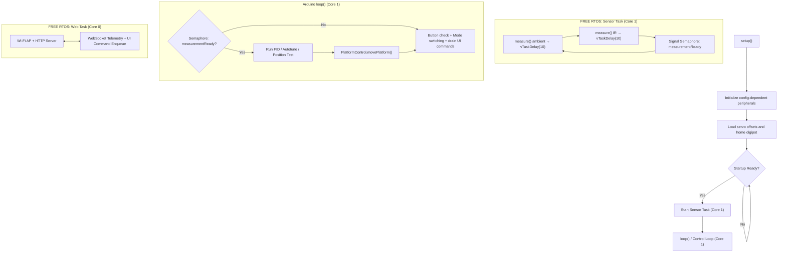

# BaBot - Firmware Code Reference

Reference for the modular ESP32-S3 firmware in this repository.

## Control Flow



## Files And Responsibilities

### [`../firmware/firmware.ino`](../firmware/firmware.ino)

- Keeps Arduino `setup()` and `loop()` entrypoints, hardware object composition, and shared runtime state.
- Includes focused internal modules for button input, control loop, PID autotune, startup, mode handlers, and UI command handling.
- Orchestrates the cooperative execution between the Arduino loop and the FreeRTOS sensor measurement task.

### Internal Firmware Modules

- `ButtonInput.h` decodes Boot-button press patterns and owns lightweight status LED stubs.
- `ControlLoop.h` owns PID, capture impulse, motion grace, telemetry publication, and closed-loop reset helpers.
- `PidAutotune.h` owns safe relay PID autotune, metrics, gain estimation, and previous-gain restore.
- `StartupManager.h` owns bench-safe startup, subsystem health, degraded-mode policy, and deferred hardware initialization.
- `ModeHandlers.h` owns ON/OFF/test/calibration/assembly/position-test behavior.
- `UiCommandHandler.h` owns Web UI command dispatch, runtime patching, persistence commands, and MUX compensation.

### [`../firmware/src/BoardConfig.h`](../firmware/src/BoardConfig.h)

- Defines the `BoardPins`, `MuxPins`, and all firmware constants.
- Encodes the routed single-mux pin map, including the `GPIO45` IR LED control line, Boot button, Wi-Fi AP settings, and web-task timing.

### [`../firmware/src/RuntimeState.h`](../firmware/src/RuntimeState.h)

- Defines shared `TelemetryState`, `RuntimeConfig`, and `UiCommand` types.
- Defines the shared `SystemStatus` model used for startup phase, subsystem health, and degraded-mode reporting.
- Publishes PID autotune metrics such as baseline/best scores, candidate queue status, progress, trial counts, and per-stage gain suggestions.
- Owns the FreeRTOS queue used to move browser-originated changes onto the control core.
- Persists runtime tuning values in the `babot_ui` NVS namespace.

### [`../firmware/src/WebUiServer.h`](../firmware/src/WebUiServer.h)

- Starts a task pinned to core `0`.
- Hosts the access-point web page and `/api/state`.
- Broadcasts telemetry/config/system-health snapshots over WebSocket, enqueues parsed commands, and flushes queued serial debug output.
- Hosts the **PID Autotune** drawer and sends start/cancel/restore commands to the control loop.

### [`../firmware/src/DebugLogger.h`](../firmware/src/DebugLogger.h)

- Owns the fixed-size FreeRTOS queue used for non-blocking debug records.
- Lets the control path enqueue bring-up logs without writing directly to the serial monitor.
- Flushes queued logs from the Wi-Fi/web task so serial transport stays off the control loop.

### [`../firmware/src/IRSensorArray.h`](../firmware/src/IRSensorArray.h)

- Samples ambient and IR-lit readings across `16` channels using a dedicated FreeRTOS task.
- Uses `vTaskDelay` during IR LED settling to yield CPU time back to the main loop and network task.
- Signals the control loop via a binary semaphore once a full measurement cycle is complete.
- Applies exponential moving average smoothing to the IR delta.
- Applies persisted per-channel MUX compensation before ball detection and centroid calculation.
- Detects ball presence from `max(irSignal) - min(irSignal) >= kBallThreshold`.
- Preserves signed IR deltas so covered sensors can report below zero instead of being clamped.
- Mirrored-edge centroid calculation over the `4x4` grid so edge sensors behave like the Leonardo firmware.
- Scales the reported `centerX` / `centerY` coordinates by `1.8x` to match the larger physical sensor grid on the new hardware.
- Emits optional CSV telemetry.

### [`../firmware/src/PlatformControl.h`](../firmware/src/PlatformControl.h)

- Wraps the three `Servo` instances.
- Implementation of the Inverse Kinematics (IK) logic. For the underlying mathematical derivation, see [Kinematics Theory](kinematics-theory.md).
- Leg-to-servo ordering (`C`, `A`, `B`) inside `movePlatform()` so closed-loop motion matches the old board.
- Attaches servos with explicit pulse widths for the ESP32 PWM implementation.
- Persists per-servo calibration offsets in ESP32 NVS using `Preferences`.
- Falls back to a dummy backend when startup policy or init results disable real actuator output.

### [`../firmware/src/X9C104Digipot.h`](../firmware/src/X9C104Digipot.h)

- Replaces the previous absolute-byte digipot write path.
- Tracks the last known tap in RAM.
- Homes to zero when first used, then steps incrementally to the requested tap.
- Supports optional non-volatile store via the `persist` argument to `setTap()`.
- Can also run in a dummy mode that preserves the requested tap in software without touching GPIO.

## Startup Model

- `setup()` now performs only safe boot work first: serial, button basics, config load, shared state, and Wi-Fi/web startup.
- Riskier hardware stages then run one at a time from `loop()`: actuator backend, digipot restore, and IR sensor bring-up.
- A tiny NVS startup journal records the currently attempted risky stage. If the board resets during that stage, the next boot skips it and reports the recovery through serial and the web UI.
- `ON` mode can continue with a dummy actuator backend for bench testing, but actuator test modes are blocked unless real servo output is available.

## Key Constants

| Constant | Value | Notes |
|---|---:|---|
| `kProportionalGain` | `3.4` | Default PID proportional gain |
| `kIntegralGain` | `0.06` | Default PID integral gain |
| `kDerivativeGain` | `12.0` | Default PID derivative gain |
| `kServoArmLengthMm` | `70.0` | Primary servo horn arm length |
| `kPassiveLinkLengthMm` | `85.0` | Passive linkage rod length |
| `kBaseRadiusMm` | `85.0` | Radius to base servo mounts |
| `kPlatformRadiusMm` | `103.9` | Radius to platform anchors |
| `kPlateHeightMm` | `115.0` | Neutral resting height |
| `kIrAlpha` | `0.8` | IR delta smoothing |
| `kBallPositionAlpha` | `0.7` | Ball position smoothing |
| `kMaxPlateTiltDeg` | `15.0` | Safety clamp for roll/pitch |
| `kBallThreshold` | `30.0` | IR signal detection threshold |
| `kSensorCount` | `16` | 1 mux x 16 channels |
| `kPositionTestRadius` | `1.2` | Simulated path radius for `POSITION_TEST` |

## Position Test

- `POSITION_TEST` is a controller test, not a sensor-channel sweep.
- It injects a synthetic circular ball position inside the same coordinate limits used by `ON` mode.
- It then calls the normal ON controller path, so the current runtime PID, capture behavior, setpoint, ball threshold, and `kMaxPlateTiltDeg` clamp are exercised together.
- Individual MUX/channel validation belongs to the MUX compensation and sensor diagnostics flow, not `POSITION_TEST`.

## PID Autotune Model

- Autotune utilizes a **Multi-Stage CMA-ES (Covariance Matrix Adaptation Evolution Strategy)** optimizer, a machine learning method designed for noise-tolerant search in high-dimensional feedback loops.
- It operates in three distinct phases:
    1. **Baseline**: Establishes a performance floor using current gains.
    2. **CMA-ES Evolution**: Samples a population of 6 candidates from a dynamic Gaussian distribution. It adaptively learns from each evaluation, shifting the search mean and adjusting the covariance matrix to stretch along the most promising gain directions.
    3. **Tune I**: Fine-tunes the Integral gain once the P/D stabilization is optimized, minimizing steady-state error.
- **Scoring Function**:
    - Each candidate is graded via a composite cost function: `Score = (Avg Radius * 150) + (Avg Speed * 120) + (Peak Speed * 50) + (Time * 0.04)`.
    - **Edge Penalty**: If the ball is "captured" but remains against the outer fence (Avg Radius > 0.8), a 300-point penalty is applied.
- **Robustness**: 
    - **Trial Averaging**: Each candidate is tested over `kPidAutotuneTrialsPerCandidate = 3` trials.
    - **Safety & Early Cancel**: The autotuner allows the full platform tilt (10.0°). If the user cancels the session early, the **best gains found so far** are automatically applied to the active controller.
- Autotune applies the resulting values in RAM only. `Save Runtime` remains the only NVS persistence step.

## Third-Party Layout

- Vendored dependencies live under [`../firmware/src/third_party/`](../firmware/src/third_party/), including ArduinoJson under `ArduinoJson/src`.
- Arduino IDE is the primary workflow. The helper compile script exists for CLI convenience and injects the include roots needed for the vendored source layout.

## Validation Expectations

- The baseline firmware should compile directly with:

```powershell
.\scripts\compile.ps1
```

- The helper script injects the include roots needed by the integrated `src/third_party` source tree:

```powershell
.\scripts\compile.ps1
```

## Hardware Caveats

- `kBallThreshold = 60.0` and `kDefaultDigipotTap = 5` are current bring-up values and still need hardware validation.
- Bench validation is still required for servo limits, sensor orientation, threshold tuning, and digipot calibration.
